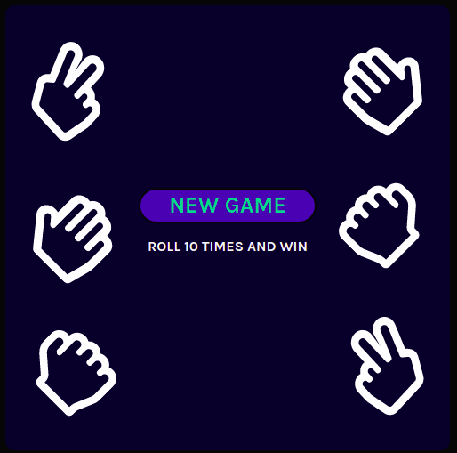

## Rock-Paper-Scissors Game

- Two screens
- Roll 10 times and win!!!

This project was bootstrapped with [Vite](https://vitejs.dev).

## Available Scripts

In the project directory, you can run:

### `npm run dev`

Runs the app in the development mode.\
Open [http://localhost:3000](http://localhost:3000) to view it in your browser.

#### Personal note.

SVG images to change colors.
